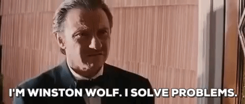

layout: true
  
<div class="my-header"></div>

<div class="my-footer">M. Ploner (UNITN) - An experiment about delegation, efficiency, and morality </div> 


```{r, load_refs, include=FALSE, cache=FALSE}


 library(RefManageR)
 myBib <- ReadBib("lit.bib", check = FALSE)
 BibOptions(check.entries = FALSE, style = "markdown", bib.style = "authoryear", cite.style = 'authoryear')
 
```

```{r setup, include=FALSE}
options(htmltools.dir.version = FALSE)
```

```{r , echo=FALSE, warning=FALSE, message=FALSE, fig.height=4, fig.width=4, fig.align="center"}
#library(tidyverse)
library(readxl)
library(knitr)
library(RColorBrewer)
library(lme4)
library(formattable)
library(knitr)
library(kableExtra)
library(texreg)
library(tidyverse)
library(zTree)
library(wesanderson)
library(lubridate)
library(gridExtra)


getPalette <- wes_palette("Royal1")

setwd("~/Google Drive/WORK/esperimenti/trento/delegate_decept/ANALISI")
#-----------------------------
d <- readRDS("DATA.rds")
#-----------------------------
# to create treatment labels
d <- d %>% mutate(Lott_type=ifelse(L_B==2,"B-",ifelse(L_B==3,"B=","B+"))) %>% mutate(Lott_type=as.factor(Lott_type))
# to create treatment labels
d <- d %>% mutate(treatment=ifelse(treatment=="cpu\"","cpu",treatment))
d$Lott_type = factor(d$Lott_type,levels(as.factor(d$Lott_type))[c(1,3,2)])
```

---

class: inverse, center, middle

# Motivation

???
Briefly introduce the main motivation of the work

- Why it is interesting
- Where it is located in the literature
- Main findings

---

class: top, left

## Motivation

- People may want to delegate others to do things they would not do themselves
  - More or less aware of the unintended consequences of delegation
        - "Morally-blinded" delegation
- The consumers can choose among several competitors for "shady" services
  - e.g., waste management, meat production, outsourcing to
      developing countries ...
        - Different degrees of morality/efficiency

--

<div class="container" style="float:right; width:40%;height:100;font-size:20px" align="left">

</div>

---

## Related Experimental Contributions


- Markets erode moral values! `r Cite(myBib,"falk2013morals")`
  - Both in bilateral and multilateral transactions
- Principals delegate allocation choices to agents `r Cite(myBib,"bartling2011shifting")`
  - "Shifting blame" allows to avoid negative consequences
- Individuals in the lab lie, though not to the full extent `r Cite(myBib,"abeler2019preferences")`
  - Incentives and consequences matter `r Cite(myBib,"gneezy2005deception")`
- People may delegate agents to perform immoral actions `r Cite(myBib,"erat2013avoiding","kandul2018care")`
  - Especially when consequences for the deceived party are large
    - "Surrogate liars" lie to a large extent when this benefits both themselves and their principal
- `r Citet(myBib,"michailidou2019d")` observe that altruistic lying in a field experiment and `r Citet(myBib,"weisel2015collaborative")` show that people are ready to cooperate in dishonest acts 

---

## Research Questions

- Do people "hire" others to be their **surrogate liars**?
--
  
  - Does the payment of a fee foster cooperation in corruption?
--

- Does cooperative corruption lead to the adoption of an inferior technology?
--
  
  - A technology that works only in "illegal" environments 
--

- Do individual social attitude impact on the likelihood of being a **surrogate liar**?
--
 
  - Are "socially-oriented" types more likely to lie for others than selfish types?
--

      - Meeting others' expectations

---

class: inverse, center, middle

# Design

---


## Interaction setting

- Two players: Principal and Agent
--

- Lottery
    - Two outcomes $p(H)=p(L)=1/2$
    - Private toss of a fair dice and self-report
      - If Even $\Rightarrow$ **H**(igh)
      - If Odd $\Rightarrow$ **L**(ow)
--
- Choice task
  - Principal can choose between tossing the dice herself (Lottery A) or let the Agent toss (Lottery B)
      - Outcomes of Lottery A and B may be different (see treatments below)
--
- Choices of Agent are collected with strategy method
  - Before knowing whether A or B was chosen by the Principal

---
  
## Treatments: lotteries (within)


- Lottery A is fixed across rounds

```{r , echo=FALSE, warning=FALSE, message=FALSE, fig.height=9, fig.width=16, fig.align="center"}

d %>% select( L_A,   H_A) %>% distinct() %>% 
  mutate(EV=L_A*.5+H_A*.5) %>% rename(`L (.5)`=L_A, `H (.5)`=H_A) %>%
kable(align = "c")   %>%
  kable_styling("hover",full_width = F, position = "center") %>%
  column_spec(1, width = "8em") %>%
  column_spec(2, width = "8em") %>% 
  column_spec(3, width = "8em")

```

- Lottery B is manipulated across rounds
  - Random order at matching group level

```{r , echo=FALSE, warning=FALSE, message=FALSE, fig.height=9, fig.width=16, fig.align="center"}

d %>% select(Lott_type, L_B,  H_B) %>% distinct() %>% mutate(EV=L_B*.5+H_B*.5) %>%
rename(Treatment=Lott_type,`L (.5)`=L_B, `H (.5)`=H_B) %>% kable(align = "c") %>%
  kable_styling("hover",full_width = F, position = "center") %>%
  column_spec(1, width = "8em") %>%
  column_spec(2, width = "8em") %>% 
  column_spec(3, width = "8em") %>% 
  column_spec(4, width = "8em") 
```

---

## Treatments

- **Human Agent**
    - **Fee**
      - Before rolling the dice, Agents can ask for to the Principal a fee between 0 and 1 Euro
        - Agents know the lottery B
      - Principals learn the fee and choose between A and B
    - **No Fee**
      - A fixed amount is paid to the Agent (disclosed afterwards)
- **CPU Agent**
    - No Fee condition interacting with a fair algorithm (50/50)

|   |  B+ |  B-  | B=  |
|---|:--:|:--:|:--:|
|Fee   | $\circ$  | $\circ$  | $\circ$ |  
|No Fee   | $\circ$  |  $\circ$ | $\circ$ | 
|CPU   | $\circ$  |  $\circ$ | $\circ$ | 


---

## Additional controls

- We control for
  - Beliefs of Principal about behavior of Agent
      - Incentivized (quadratic scoring rule)
  - Other-ragarding attitudes
      - SVO
---

## Behavioral predictions


<small>
.pull-left[
- .blue[Honest Principal] 
  - .blue[Honest Agent]
      - **Choice**
          - B+ &rarr; Delegate (&euro; ~6.5)
          - B= &rarr; Retain (&euro; ~5.0)
          - B- &rarr; Retain (&euro; ~4.0)
      - **Report**
          - Truthful (50/50)
  - .red[Dishonest Agent]
      - **Choice**
          - B+ &rarr; Delegate (&euro; 9.0)
          - B= &rarr; Delegate (&euro; 7.0)
          - B- &rarr; Delegate (&euro; 6.0)
      - **Report**
          - Truthful (50/50)
]

.pull-right[
- .red[Dishonest Principal]
  - .blue[Honest Agent]
      - **Choice**
          - B+ &rarr; Retain (&euro; 7.0)
          - B= &rarr; Retain (&euro; 7.0)
          - B- &rarr; Retain (&euro; 7.0)
      - **Report**
          - Biased (0/100)
  - .red[Dishonest Agent]
      - **Choice**
          - B+ &rarr; Delegate (&euro; 9.0)
          - B= &rarr; Retain (&euro; 7.0)
          - B- &rarr; Retain (&euro; 7.0)
      - **Report**
          - Biased (0/100)  
]

</small>

---

## Participants and Procedures

- Administered and programmed in Z-Tree
- `r d %>% distinct(Session.ID ) %>% nrow()` Sessions run @ CEEL
  - Total number of participants: `r d %>% distinct(ID) %>% nrow()`
`r d %>% group_by(treatment) %>% distinct(ID) %>% summarise_at("ID",list(N=~n())) %>% kable()`
  - Total number of observations: `r d %>% nrow()`
- Earnings of Agents are fixed and announced at the end of the experiment 
  
---

class: inverse, center, middle

# Results

---

class: inverse, center, middle

## Agents

---

## Reported outcomes

.left-column[

```{r , echo=FALSE, warning=FALSE, message=FALSE, fig.height=9, fig.width=16, fig.align="center"}

stats.overall <- d %>% filter(Role=="Subject 2") %>%
      dplyr::group_by(Report) %>%
      dplyr::summarise (x=n()) %>%
      dplyr::mutate(n=sum(x)) %>%
      dplyr::mutate(rel.freq = round(x/n, 3))


stats <- d %>% filter(Role=="Subject 2") %>%
      dplyr::group_by(Report, Lott_type) %>%
      dplyr::summarise (x=n()) %>%
      dplyr::group_by(Lott_type) %>%
      dplyr::mutate(n=sum(x)) %>%
      dplyr::mutate(rel.freq = round(x/n, 3)) %>%
      arrange(Lott_type)

stats$LL <- -99
stats$UL <- -99

for (i in 1:nrow(stats[,1])){
stats[i,"LL"] <- prop.test(pull(stats[i,"x"]), pull(stats[i,"n"]))$conf.int[1]
stats[i,"UL"] <- prop.test(pull(stats[i,"x"]), pull(stats[i,"n"]))$conf.int[2]
}

 ggplot(stats %>%
        filter(Report=="Even"),
   aes(x=as.factor(1),y=rel.freq,label=rel.freq,fill=Lott_type))+
   geom_col(fill=getPalette[1],color="black",alpha=.5)+
   facet_grid(~Lott_type,switch="y")+
   geom_errorbar(aes(ymin=LL, ymax=UL), width=.3)+
   geom_hline(yintercept=.5,linetype=1,color="red")+
   geom_text(nudge_y=0.03,nudge_x=-0.3)+
   geom_hline(data=stats.overall %>% filter(Report=="Even"),aes(yintercept=rel.freq),linetype=2)+
   scale_y_continuous(breaks=c(seq(0,1,.5)),minor_breaks=c(seq(0,1,.1)), limits = c(0, 1))+
   scale_fill_manual(values=getPalette)+
 theme_bw() +
 labs(title="Reported Even Outcome (High)",
     subtitle="Agent",
     y = "Frequency (conf. int.)",
     x= "",
     fill="",
     caption="")+ # labels
theme(legend.position="bottom",
      strip.text.x = element_text(size = 16),
      axis.text=element_text(size=8),
      axis.title=element_text(size=14,face="bold"),
      axis.text.x = element_text(angle = 90, hjust = 1,vjust=0.5,size=0)) #axis

```

]

.right-column[

- Agents are likely to misreport only for **dominated lotteries** ( B- )
- No significant differences between *Fee* and *No Fee* condition

]

---

## Fees and reports

.left-column[

```{r , echo=FALSE, warning=FALSE, message=FALSE, fig.height=9, fig.width=16, fig.align="center"}

stats <- d %>%
filter(Role=="Subject 2") %>%
filter(treatment=="fee") %>%
      dplyr::group_by(Lott_type, Report) %>%
      dplyr::summarise_at("fee",funs(mean,sd,median)) %>%
      mutate(Report=ifelse(Report=="Even","High","Low"))

ggplot( d %>%
filter(Role=="Subject 2") %>%
filter(treatment=="fee") %>%
      mutate(Report=ifelse(Report=="Even","High","Low")),
 aes(x=Report,y=fee))+
 geom_boxplot(fill=getPalette[1],alpha=.5)+
  stat_summary(fun="mean")+
 facet_grid(~Lott_type,switch="y")+
theme_bw() +
labs(title="Fees asked and reported outcome",
   subtitle="",
   y = "Average fee requested",
   x= "Reported outcome",
   fill="",
   caption="")+ # labels
theme(legend.position="bottom",
    axis.text=element_text(size=12),
          strip.text.x = element_text(size = 16),
    axis.title=element_text(size=14,face="bold"),
    axis.text.x = element_text(angle = 90, hjust = 1,vjust=0.5)) #axis


```

]

.right-column[

- Those reporting Even (high outcome) are not asking a larger fee
  - The fee is not a "refund" for misreporting

]

---

## Reported outcome and social type 

.left-column[

```{r , echo=FALSE, warning=FALSE, message=FALSE, fig.height=9, fig.width=16, fig.align="center"}

stats.overall <- d %>%
      dplyr::group_by(Role, svo_types, Report) %>%
      dplyr::summarise (x=n()) %>%
      dplyr::group_by(Role, svo_types) %>%
      dplyr::mutate(n=sum(x)) %>%
      dplyr::mutate(rel.freq = round(x/n, 3))

stats <- d %>%
      dplyr::group_by(Role, svo_types, Report, Lott_type) %>%
      dplyr::summarise (x=n()) %>%
      dplyr::group_by(Role, svo_types, Lott_type) %>%
      dplyr::mutate(n=sum(x)) %>%
      dplyr::mutate(rel.freq = round(x/n, 3))

stats$LL <- -99
stats$UL <- -99

for (i in 1:nrow(stats[,1])){
stats[i,"LL"] <- prop.test(pull(stats[i,"x"]), pull(stats[i,"n"]))$conf.int[1]
stats[i,"UL"] <- prop.test(pull(stats[i,"x"]), pull(stats[i,"n"]))$conf.int[2]
}


ggplot(stats %>%
       filter(Report=="Even" & Role=="Subject 2"),
  aes(x=as.factor(1),y=rel.freq,label=rel.freq))+
  geom_col(fill=getPalette[1],color="black",alpha=.5)+
  geom_errorbar(aes(ymin=LL, ymax=UL), width=.3)+
  geom_hline(yintercept=.5,linetype=1,color="red")+
  geom_text(nudge_y=0.03,nudge_x=-0.3)+
  scale_y_continuous(breaks=c(seq(0,1,.5)),minor_breaks=c(seq(0,1,.1)), limits = c(0, 1))+
  scale_fill_manual(values=getPalette)+
  facet_grid(svo_types~Lott_type,switch="y")+
theme_bw() +
labs(title="Reported even outcome (High)",
    subtitle="Agent",
    y = "Frequency (conf. int.)",
    x= "",
    fill="",
    caption="")+ # labels
theme(legend.position="bottom",
     axis.text=element_text(size= 12),
           strip.text.x = element_text(size = 16),
     axis.title=element_text(size=14,face="bold"),
     axis.text.x = element_text(angle = 90, hjust = 1,vjust=0.5,size=0)) #axis
```

]

.right-column[

- Prosocial and Individualist differ in their behavior
  - **Prosocial** tend to lie in the **dominated lottery** (B- ) 
  - **Individualist** tend to lie in the **dominating lottery** ( B+ )
  
]

---

class: inverse, center, middle

## Principals

---

##  Choice to retain control & Beliefs

.left-column[

```{r , echo=FALSE, warning=FALSE, message=FALSE, fig.height=12, fig.width=16, fig.align="center"}

stats <- d %>% filter(Role=="Subject 1") %>%
      mutate(Condition=as.factor(ifelse(treatment=="cpu","CPU","Human"))) %>%
      dplyr::group_by(choose_A, Condition,Lott_type) %>%
      dplyr::summarise (x=n()) %>%
      dplyr::group_by(Lott_type, Condition) %>%
      dplyr::mutate(n=sum(x)) %>%
      dplyr::mutate(rel.freq = round(x/n, 3))


stats$LL <- -99
stats$UL <- -99

for (i in 1:nrow(stats[,1])){
stats[i,"LL"] <- prop.test(pull(stats[i,"x"]), pull(stats[i,"n"]))$conf.int[1]
stats[i,"UL"] <- prop.test(pull(stats[i,"x"]), pull(stats[i,"n"]))$conf.int[2]
}

g.1 <- ggplot(stats %>%
      filter(choose_A==1),
 aes(x=Condition,y=rel.freq,label=rel.freq,fill=Condition))+
 geom_bar(stat="identity",color="black",alpha=.5)+
 geom_text(nudge_y=0.03,nudge_x=-0.3)+
 facet_grid(~Lott_type,switch="y")+
 scale_y_continuous(breaks=c(seq(0,1,.5)),minor_breaks=c(seq(0,1,.1)), limits = c(0, 1))+
 geom_errorbar(aes(ymin=LL, ymax=UL), width=.3)+
 geom_hline(yintercept=.5,linetype=1,color="red")+
scale_fill_manual(values = getPalette)+
theme_bw() +
labs(title="Principal: Retain Control ",
   subtitle="",
   y = "Frequency",
   x= "Condition",
   fill="",
   caption="")+ # labels
theme(legend.position="bottom",
    axis.text=element_text(size=8),
          strip.text.x = element_text(size = 16),
    axis.title=element_text(size=14,face="bold"),
    axis.text.x = element_text(angle = 90, hjust = 1,vjust=0.5)) #axis

stats <- d %>%
filter(Role=="Subject 1") %>%
      dplyr::group_by(Belief, treatment, Lott_type) %>%
      dplyr::summarise (x=n()) %>%
      dplyr::group_by(Lott_type, treatment) %>%
      dplyr::mutate(n=sum(x)) %>%
      dplyr::mutate(rel.freq = round(x/n, 3)) %>% mutate(Belief=ifelse(Belief==1,0,ifelse(Belief==2,0.25,ifelse(Belief==3,0.5,ifelse(Belief==4,0.75,1))))) %>%
      arrange(treatment)

summary <- d %>%
filter(Role=="Subject 1") %>%
      dplyr::group_by(treatment, Lott_type) %>%
      mutate(Belief=ifelse(Belief==1,0,ifelse(Belief==2,0.25,ifelse(Belief==3,0.5,ifelse(Belief==4,0.75,1))))) %>%
      dplyr::summarise_at("Belief",funs(mean=mean))

Actual <- d %>%
      dplyr::group_by(Role, Report, treatment,Lott_type) %>%
      dplyr::summarise (x=n()) %>%
      dplyr::group_by(Role, treatment, Lott_type) %>%
      dplyr::mutate(n=sum(x)) %>%
      dplyr::mutate(rel.freq = round(x/n, 3))%>%
      mutate(act_mean=rel.freq) %>%
      filter(Role=="Subject 2" & Report=="Even")

g.2 <- ggplot(stats,
 aes(x=Belief,y=rel.freq,label=rel.freq,fill=treatment))+
 geom_col(color="black",alpha=.5)+
 geom_vline(data=summary,  aes(xintercept=mean),linetype=2)+
 geom_vline(data=Actual,aes(xintercept=act_mean),color="red",linetype=1)+
 scale_x_continuous(breaks=c(0,.25,.50,.75,1),labels=c("0%", "25%",
                               "50%","75%","100%")) +
 facet_grid(treatment~Lott_type,switch="y")+
 ylim(0,1)+
scale_fill_manual(values = getPalette)+

theme_bw() +
labs(title="Principal: Beliefs",
   subtitle="(red line = actual frequency)",
   y = "Frequency",
   x= "Even outcome",
   fill="",
   caption="")+ # labels
theme(legend.position="bottom",
    axis.text=element_text(size=8),
               strip.text.x = element_text(size = 16),

    axis.title=element_text(size=14,face="bold"),
    axis.text.x = element_text(angle = 90, hjust = 1,vjust=0.5)) #axis

grid.arrange(g.1, g.2, ncol=1)
```

]

.right-column[
- Principals are delegating only in the dominating condition B-
    - No difference between human and computer condition
      - Implicitly assume that agents behave honestly 
- Preference for control (B= in CPU)
  - Illusion of control
]


---

## Reported outcomes

.left-column[
```{r , echo=FALSE, warning=FALSE, message=FALSE, fig.height=9, fig.width=16, fig.align="center"}

stats.overall <- d %>% filter(Role=="Subject 1" & choose_A==1) %>%
      dplyr::group_by(Report) %>%
      dplyr::summarise (x=n()) %>%
      dplyr::mutate(n=sum(x)) %>%
      dplyr::mutate(rel.freq = round(x/n, 3))


stats <- d %>% filter(Role=="Subject 1" & choose_A==1) %>%
      dplyr::group_by(Report, Lott_type) %>%
      dplyr::summarise (x=n()) %>%
      dplyr::group_by(Lott_type) %>%
      dplyr::mutate(n=sum(x)) %>%
      dplyr::mutate(rel.freq = round(x/n, 3)) %>%
      arrange(Lott_type)

stats$LL <- -99
stats$UL <- -99

for (i in 1:nrow(stats[,1])){
stats[i,"LL"] <- prop.test(pull(stats[i,"x"]), pull(stats[i,"n"]))$conf.int[1]
stats[i,"UL"] <- prop.test(pull(stats[i,"x"]), pull(stats[i,"n"]))$conf.int[2]
}

 ggplot(stats %>%
        filter(Report=="Even"),
   aes(x=as.factor(1),y=rel.freq,label=rel.freq,fill=Lott_type))+
   geom_col(fill=getPalette[1],color="black",alpha=.5)+
   facet_grid(~Lott_type,switch="y")+
   geom_errorbar(aes(ymin=LL, ymax=UL), width=.3)+
   geom_hline(yintercept=.5,linetype=1,color="red")+
   geom_text(nudge_y=0.03,nudge_x=-0.3)+
  geom_text(data= stats %>% select(Lott_type,n) %>% distinct(),aes(x=1,y=0,label=paste("N=",n,sep="")),nudge_y = 0, nudge_x=-.54)+
   geom_hline(data=stats.overall %>% filter(Report=="Even"),aes(yintercept=rel.freq),linetype=2)+
   scale_y_continuous(breaks=c(seq(0,1,.5)),minor_breaks=c(seq(0,1,.1)), limits = c(0, 1))+
   scale_fill_manual(values=getPalette)+
 theme_bw() +
 labs(title="Reported Even Outcome (High)",
     subtitle="Principal",
     y = "Frequency (conf. int.)",
     x= "Treatment",
     fill="",
     caption="")+ # labels
theme(legend.position="bottom",
      axis.text=element_text(size=8),
            strip.text.x = element_text(size = 16),
      axis.title=element_text(size=14,face="bold"),
      axis.text.x = element_text(angle = 90, hjust = 1,vjust=0.5,size=0)) #axis


```
]

.right-column[
- Principals are very likely to lie
  - No difference in propensity to lie across conditions
  - No difference in propensity to lie across lotteries
]

---

class: inverse, center, middle

# Conclusions

---

## Summary 


1. Agents are not generally willing to lie for others
    - The tend to lie only in the "inferior" lottery B-
        - This is mainly driven by the prosocial types
    - The payment of a fee does not affect the propensity to lie
--
2. Principals are not generally delegating others to lie and "internalize" the task
    - Correctly anticipate the honesty of agents
    - They delegate only in B+
        - Interestingly, $E[B+]< H_A$ but still delegate!

---

## Discussion

- Agents are generally not willing to lie for "altruistic" reasons
    - They lie when their technology is worse than that of the Principal
        - The expectations of the delegating Principal are explicit
            - Let-down aversion may induce to lie
                - Mediated by individual social atttiudes
          - Second order expectations create stronger commitment than the fee
                
- Principals do not generally delegate others to lie and directly lie 
    - They anticipate honesty of agents
    - They delegate only when the expected outcomes of an honest report by the agent are reasobably high (but still lower than those of a direct lie)
        - To lie is a cost but it is easily overcome by economic incentives 

---

class: inverse, middle, center

## Thanks!


Your comments and suggestions will be greatly appreciated.

You can find these slides on my website:

.red[**matteoploner.eco.unitn.it**]

---

# References

.compact[

```{r refs, echo=FALSE, results="asis"}
PrintBibliography(myBib)
```

]
